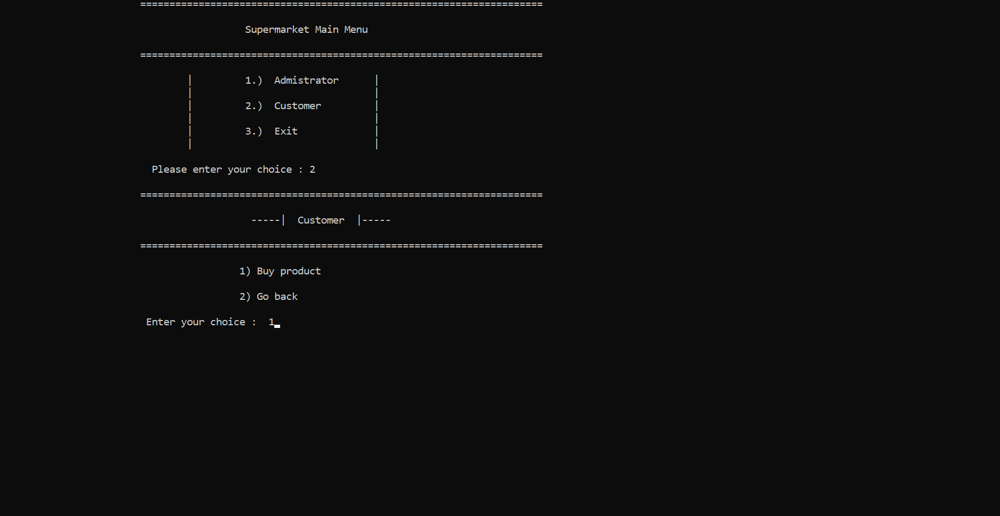
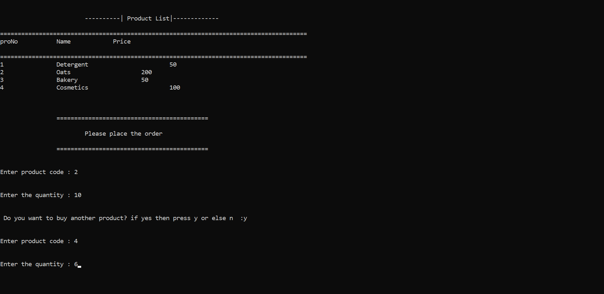
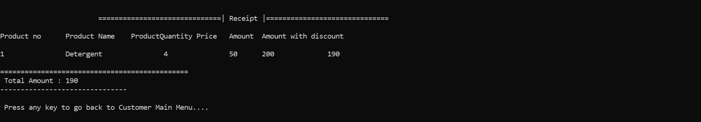
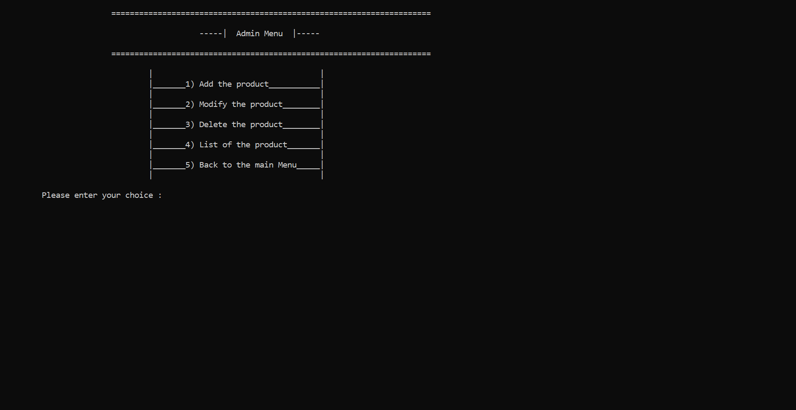
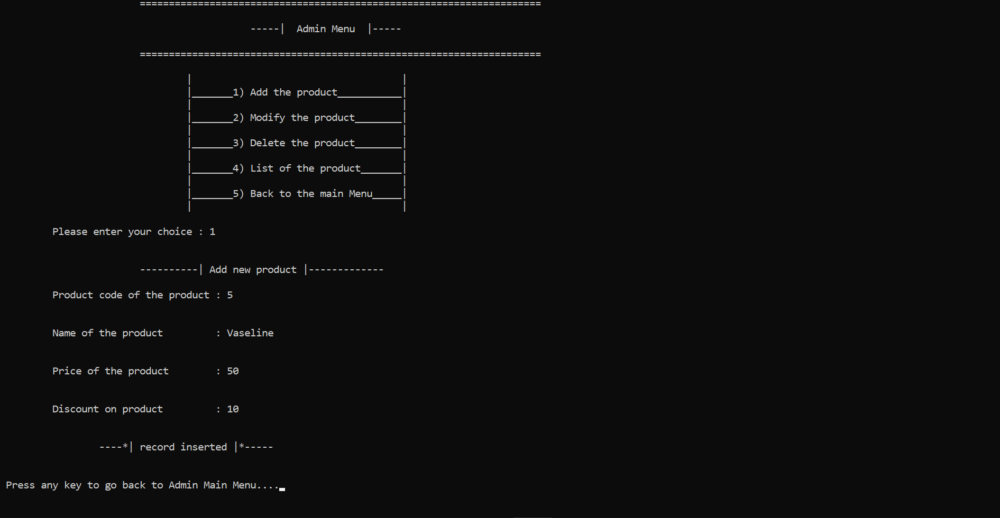

# Shopping System Project

## Overview

This C++ project is a comprehensive shopping system that caters to both administrators and customers. It offers features such as product management, secure authentication for administrators, and a user-friendly interface for customers to browse and purchase products.

#### Main Menu

#### Customer Panel

#### Receipt

#### Admin Panel

## Features

### Administrator Module

- **Secure Login:**
  - Administrators can securely log in using email and password verification.
  
- **Product Management:**
  - Add, modify, delete, and list products with ease.
  
### Customer Module

- **Intuitive Interface:**
  - Customers can browse and purchase products through a user-friendly interface.
  
- **Receipt Generation:**
  - Automatic generation of receipts for customer purchases.

### Product Management

- **Data Structure:**
  - Structured handling of product details, including code, name, price, and discount.
  - Utilized file handling for persistent storage of product data.

### Security Measures

- **User Authentication:**
  - Passwords are securely stored, ensuring robust user authentication.
  
- **Data Integrity:**
  - Implemented measures to prevent duplicate product entries and maintain data integrity.

## Usage

1. **Compile:**
   - Compile the program using a C++ compiler.
  
2. **Run:**
   - Execute the compiled program.
  
3. **Follow On-Screen Instructions:**
   - For administrators, log in and use the menu options.
   - For customers, follow the prompts to browse and make purchases.

## Contribution

Contributions are welcome! If you'd like to contribute to the project, please follow these steps:

1. Fork the repository.
2. Create a new branch for your feature or bug fix.
3. Make changes and submit a pull request.

## License

This project is licensed under the [MIT License](LICENSE).

Feel free to explore and enhance the shopping system project!
